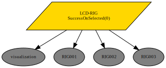
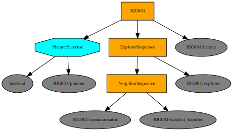

# Limited Communicating Distributed Robotic Information Gathering (LCD-RIG) Systems

Python configure : /home/redwan/anaconda3/envs/rig/bin/python

### Dependencies
    * PyPolo
    * py_trees
To build simpy types simply type
```bash 
pip3 install -r requirements.txt
```

## RUN LCD-RIG 

To run LCD-RIG change ```runner.sh``` file
* modify your python path 
* change the number of agents 
* lcdrig function is responsible to run LCD-RIG algorithm. 
* srig function will visualize single RIG behavior 


## Behavior tree for LCD-RIG


System Overview 



Individual RIG system 




#TODO 
* To use custom dataset, create a numpy array data and save it to ```data/srtm/preprocessed``` directory
* go to runner.sh file and change env-name to <your-env-name> without npy extension